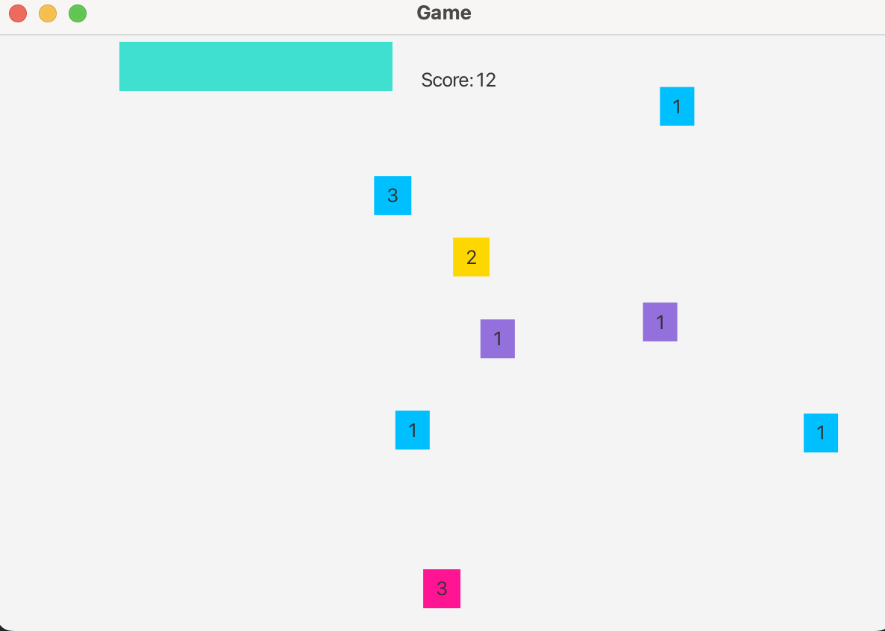

# Color Matching Game
## Rules:
Start screen displays instructions and start button
Upon clicking start, a color strip appears on the top half of the window
- A score label will appear next to the strip, adding the points as you click the buttons
- Every 3 seconds the strip will change color randomly
- Then x number of colored buttons will appear at a random location on the screen (underneath the strip) and display different colors. They will appear for a random amount of time between .5-3 seconds. Each button will display an integer that says how many points it is worth, corresponding to how long it appears on screen. Points range from 1-3.
- Clicking the correct color will earn you points (and a happy emoji) and clicking the wrong one will penalize you (and show a sad emoji)
  
